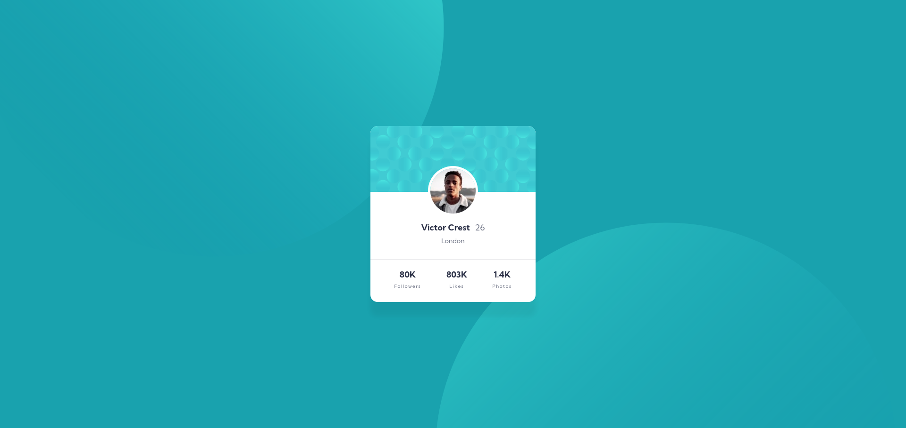
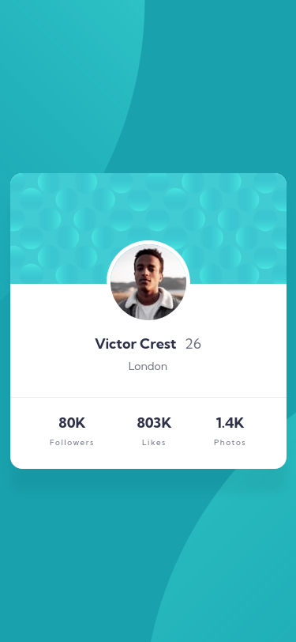

# Frontend Mentor - Profile card component solution

This is a solution to the [Profile card component challenge on Frontend Mentor](https://www.frontendmentor.io/challenges/profile-card-component-cfArpWshJ). Frontend Mentor challenges help you improve your coding skills by building realistic projects.

## Table of contents

- [Overview](#overview)
  - [The challenge](#the-challenge)
  - [Screenshot](#screenshot)
  - [Links](#links)
- [My process](#my-process)
  - [Built with](#built-with)
  - [What I learned](#what-i-learned)
- [Author](#author)
- [Acknowledgments](#acknowledgments)

## Overview

### The challenge

- Build out the project to the designs provided

### Screenshot




### Links

- Solution URL: [Fronend Mentor Solution](https://www.frontendmentor.io/solutions/profile-card-component-solution-using-flexbox-YbzQVPcGC)
- Live Site URL: [My Netlify site](https://confident-bose-f1e505.netlify.app/)

## My process

I started out by setting the "oval" images as pseudo elements. The problem with that is that no matter what I did, those 2 images moved as the browser grew or shrank. Fortunately, I ran across another member's design and while our coding was somewhat similar, his solution for those 2 "ovals" was to use them as part of the background. Honestly, I knew there was a way, but wasn't sure how to deal with TWO background images. Big shoutout to Danilo Alves (https://github.com/mizek1). As for the rest, well, I used Flexbox.

### Built with

- Semantic HTML5 markup
- CSS custom properties
- Flexbox

### What I learned

I learned how to use and position 2 images as part of the background

code below:

```css
.container {
  background-color: var(--bg-clr);
  background-image: url(../images/bg-pattern-top.svg),
    url(../images/bg-pattern-bottom.svg);
  background-repeat: no-repeat no-repeat;
  background-position: right 51vw bottom 40vh, left 48vw top 52vh;
  display: flex;
  flex-direction: column;
  align-items: center;
  justify-content: center;
  width: calc(100vw - (100vw - 100%));
  height: 100vh;
}
```

## Author

- Frontend Mentor - [@mexwebdev21](https://www.frontendmentor.io/profile/mexwebdev21)
- Twitter - [@mexwebdev2121](https://www.twitter.com/mexwebdev2121)

## Acknowledgments

Again, a big shoutout to Danilo Alves (https://github.com/mizek1). His background solution was pure gold.
